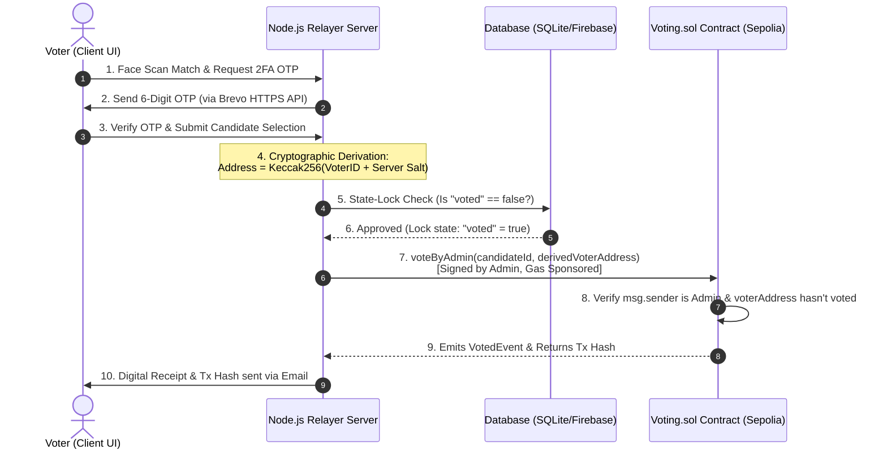

# 🗳️ SecureVote: Blockchain-Based Decentralized & Gasless Online Voting System

[](https://react.dev/)
[](https://vite.dev/)
[](https://soliditylang.org/)
[](https://hardhat.org/)
[](https://opensource.org/licenses/MIT)

**SecureVote** is a state-of-the-art, secure, and decentralized digital voting system that combines **Ethereum blockchain technology**, **facial biometrics**, and **two-factor email authentication (OTP)**. The system solves the primary user-experience hurdles of traditional Web3 apps through a **hybrid gasless/walletless architecture**, allowing regular citizens to participate in secure elections without managing private keys, installing crypto wallets, or paying gas fees.

---

## 🌟 Key Features

### 1. Hybrid Gasless & Walletless Blockchain Model
* **Deterministic Wallet Derivation:** Generates unique, secure Ethereum addresses for voters on-the-fly using their **Voter ID (EPIC number)** and a private server-side salt. Voters do not need to install MetaMask or manage seed phrases.
* **Gasless Backend Relayer:** The backend server acts as a relayer. When a user authenticates via biometrics and email OTP, the server signs and submits the transaction using an **Admin Wallet**, sponsoring the network gas fees.

### 2. Multi-Factor Identity Verification
* **Biometric Face Verification:** Leverages `face-api.js` directly in the browser to perform facial scanning and recognition, ensuring only registered users cast votes.
* **HTTP-based 2FA OTP:** Delivers a secure 6-digit OTP code to the voter's registered email before transaction execution, utilizing the **Brevo HTTP API** to completely bypass cloud outbound SMTP port restrictions (which block ports 25, 465, and 587 on platforms like Render).

### 3. Dual-Layer Double-Voting Prevention
* **Database State Locking:** Real-time checking on SQLite/Firebase to mark users as `voted: true` immediately after OTP validation.
* **On-Chain Smart Contract Assertions:** The Solidity contract enforces `require(!voters[_voter], "Voter has already voted.")` on-chain. Once a voter's derived address has voted, the EVM automatically reverts any further attempts.

### 4. Independent Audit & Monitoring
* **Auditor Dashboard:** Provides a dedicated portal for independent auditors to inspect the election state, verify the deployed smart contract ABI/code integrity, check live logs, view blockchain transaction hashes, and download reports.
* **Digital Transaction Receipts:** Automatically emails voters a detailed cryptographic receipt containing their transaction hash (`txHash`), enabling them to independently verify their vote on Etherscan.

### 5. Accessibility & Localization
* **i18n Translation:** Provides multilingual support (including English, Hindi, and Telugu) via `react-i18next` to make the voting experience inclusive and accessible.

---

## 🏗️ Technical Architecture & Data Flow

Below is the execution flow of how a voter's transaction is authenticated, processed, and cryptographically written to the Ethereum Sepolia Testnet:



---

## 💻 Tech Stack

### Frontend (Client)
* **Core:** React 19, Vite, Tailwind CSS (for modern UI components)
* **Animations:** Framer Motion (smooth transition effects)
* **Icons:** Lucide React
* **Charts:** Chart.js & React-ChartJS-2 (real-time visual results)
* **Localization:** i18next & react-i18next
* **Biometrics:** Face-api.js (Webcam facial landmark tracking)

### Backend (Server)
* **Runtime:** Node.js (Express framework)
* **Database:** SQLite3 (local development) / Firebase (cloud integration)
* **Email Client:** Nodemailer (SMTP fallback) & Brevo REST API (HTTPS production relay)
* **Web3 Integration:** Ethers.js (v6)

### Blockchain (Smart Contract)
* **Language:** Solidity (v0.8.28)
* **Development Toolkit:** Hardhat
* **Networks:** Local Hardhat Node (development) / Ethereum Sepolia Testnet (deployment)

---

## ⚙️ Project Setup & Installation

### Prerequisites
* **Node.js** (v18.x or above)
* **Git**
* **MetaMask** (or any Ethereum private key loaded with Sepolia Testnet ETH)
* **Brevo API Key** (Free transactional email service API key)

### 1. Clone the Repository
```bash
git clone https://github.com/senguptakrishnendu103-dotcom/secure-blockchain-voting.git
cd secure-blockchain-voting
```

### 2. Install Dependencies
Install packages for both the root (React frontend, Hardhat) and the express server:
```bash
# Install frontend & contract development dependencies
npm install

# Install server dependencies
cd server
npm install
cd ..
```

### 3. Configure Environment Variables
Create a `.env` file in the root directory by copying the `.env.example`:
```bash
cp .env.example .env
```
Fill in the configuration details:
```env
# Public Variables (accessible by Vite)
VITE_API_URL=http://localhost:5000/api
VITE_CONTRACT_ADDRESS=0xA033b7a4d0A2713254742945381D921F37DDf000
VITE_RPC_URL=https://ethereum-sepolia-rpc.publicnode.com

# Private Variables (Keep Server-Side Only)
SEPOLIA_RPC_URL=https://eth-sepolia.g.alchemy.com/v2/your-alchemy-key
PRIVATE_KEY=your_admin_wallet_private_key
BREVO_API_KEY=your_brevo_api_key
EMAIL_USER=your_gmail_address
EMAIL_PASS=your_gmail_app_password
```

---

## 🚀 Running the Application Locally

You can launch the entire ecosystem (Hardhat local blockchain, Node.js API server, and React dev server) concurrently:

### 1. Launch All Services (Local Sandbox)
```bash
npm run start-all
```
This single command executes three background tasks concurrently using `concurrently`:
1. Launches a local Hardhat Ethereum node (`npx hardhat node` on `http://127.0.0.1:8545`).
2. Starts the Node.js/Express server (`node server/index.cjs` on Port 5000).
3. Spins up the Vite/React application (`npm run dev` on `http://localhost:5173`).

### 2. Reset the System (Clears Votes)
If you want to wipe the SQLite/Firebase voters database and reset the smart contract's state back to zero:
```bash
npm run reset-all
```

---

## 📜 Smart Contract Lifecycle & Commands

The project manages its blockchain code in the `/contracts` directory via Hardhat:

### Compile Smart Contracts
Generates compilation artifacts inside `src/artifacts/`:
```bash
npx hardhat compile
```

### Deploy to Local Network
```bash
npx hardhat run scripts/deploy.cjs --network localhost
```

### Deploy to Sepolia Testnet
```bash
npx hardhat run scripts/deploy.cjs --network sepolia
```

---

## 🛡️ Jury Presentation: Defense Q&A

### Q1: Why did you use a Blockchain instead of a standard SQL database like PostgreSQL?
> **Answer:** Standard databases are mutable and centralized. Anyone with DB Admin access can modify records directly (e.g., performing a raw `UPDATE` to alter the votes count). A blockchain ledger is cryptographically immutable. Once a vote transaction is minted on the blockchain, its state cannot be rewritten or modified by developers, hosts, or intruders.

### Q2: If the Admin wallet submits all transactions, how do we know the Admin isn't manipulating the votes?
> **Answer:** In this prototype, the Admin is a trusted relayer. However, to guarantee integrity:
> 1. The system emails an immediate transaction hash receipt to the voter. Voters can paste this hash on Sepolia Etherscan to independently verify their vote is cast correctly.
> 2. **Production Path:** We would implement **EIP-712 Meta-Transactions**. The voter's browser would generate a keypair locally, sign a message containing their vote (e.g., `"I vote for Candidate A"`), and send that signature to the server. The admin wallet sponsors the gas, but the smart contract uses `ecrecover` on-chain to verify the voter's signature. If the admin attempts to alter the vote, the signature validation fails and the EVM reverts the transaction.

### Q3: How do you guarantee voter privacy (ballot secrecy) on a public blockchain ledger?
> **Answer:** The smart contract does *not* store real-world identities (names, emails, student IDs). It only stores the status mapping of the derived Ethereum address: `voters[voterAddress] = true`. Because the mapping from a real-world ID to the derived address relies on a secret server salt kept securely in the backend `.env` file, outside observers looking at Etherscan have no way to trace a voter address back to a real person.

### Q4: Storing OTPs in a local in-memory Map works for a prototype, but why is it bad for production and how do you fix it?
> **Answer:** In-memory storage is stateful. If the server container restarts or scales horizontally (load-balancing multiple servers), the session OTPs are lost or inaccessible across nodes. In production, we would use a fast, temporary key-value cache database like **Redis** with a built-in TTL (Time-To-Live) expiration.

---

## 📄 License
This project is licensed under the MIT License - see the [LICENSE](LICENSE) file for details.
