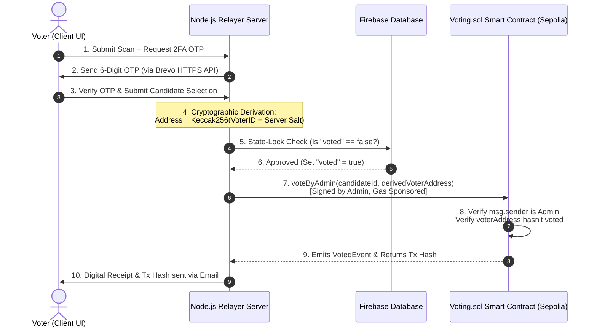

# SecureVote: Blockchain Implementation & Jury Defense Guide

This guide details the exact architecture, smart contract mechanics, and cryptographic systems used to implement the blockchain voting mechanism in **SecureVote**. It is structured to help you answer any blockchain-related questions from a technical jury.

---

## 1. Executive Summary: What we did with the Blockchain

In standard Web3 applications, users must install a crypto wallet (like MetaMask), buy cryptocurrency, and pay "gas fees" to interact with a smart contract. This creates a massive barrier to entry.

To solve this, **SecureVote** implements a **Hybrid Gasless/Walletless Blockchain Model**:
1. **Solidity Smart Contract:** We wrote and deployed a `Voting.sol` contract on the **Ethereum Sepolia Testnet** that manages election state (candidates, votes, start/end status).
2. **Deterministic Address Derivation:** We derive unique, secure Ethereum addresses for voters on-the-fly using their **Voter ID** and a private server salt. Voters do not need to manage private keys.
3. **Gasless Backend Relayer:** The backend server acts as a relayer. When a user authenticates via facial biometrics and email OTP, the server signs and submits the transaction using an **Admin Wallet**, sponsoring the gas fees.

---

## 2. Technical Architecture & Data Flow

Below is the flow of how a voter's action is recorded immutably on the Ethereum blockchain:



---

## 3. Core Technical Pillars

### A. The Solidity Smart Contract (`Voting.sol`)
* **Contract Address:** `0xA033b7a4d0A2713254742945381D921F37DDf000` (Deployed on Sepolia Testnet).
* **State Management:**
  * Candidates are tracked in a custom struct:
    ```solidity
    struct Candidate {
        uint256 id;
        string name;
        uint256 voteCount;
    }
    mapping(uint256 => Candidate) public candidates;
    ```
  * Voter status is tracked by their Ethereum address:
    ```solidity
    mapping(address => bool) public voters;
    ```
* **The `voteByAdmin` Modifier and Method:**
  To support gasless voting, the contract defines a privileged method:
  ```solidity
  function voteByAdmin(uint256 _candidateId, address _voter) public onlyAdmin {
      require(electionStarted, "Election has not started yet.");
      require(!electionEnded, "Election has ended.");
      require(!voters[_voter], "Voter has already voted.");
      require(_candidateId > 0 && _candidateId <= candidatesCount, "Invalid candidate.");

      voters[_voter] = true;
      voterList.push(_voter);
      candidates[_candidateId].voteCount++;

      emit VotedEvent(_candidateId);
  }
  ```
  * **Why is this secure?** The `onlyAdmin` modifier restricts execution strictly to the backend relayer. If a hacker attempts to call this function directly from their own wallet, it will fail.

### B. Cryptographic Key & Address Derivation
Instead of forcing users to sign in with MetaMask, we generate a unique cryptographic wallet address for them on the fly. 
In `server/index.cjs`, the server runs:
```javascript
const getVoterAddress = (voterId) => {
  const entropy = ethers.keccak256(ethers.toUtf8Bytes(voterId.toLowerCase() + "secure_voting_salt_2026"));
  const wallet = new ethers.Wallet(entropy);
  return wallet.address;
};
```
* **How it works:**
  1. It takes the voter's unique identifier (e.g. Student ID or EPIC card).
  2. Appends a private, environment-locked server-side salt (`"secure_voting_salt_2026"`).
  3. Hashes the string using **Keccak-256** (Ethereum's native SHA-3 hashing algorithm).
  4. Uses this hash as the **private key entropy** to instantiate an Ethereum Wallet.
  5. Extracts the public **Ethereum Address** to represent the voter on-chain.
* **Benefit:** The same voter ID always produces the exact same Ethereum address. This allows us to check double-voting on-chain without storing private keys in the frontend.

### C. Gasless Relayer Mechanism
* When the user's OTP is verified on `/api/verify-otp`, the server fetches the contract instance using the admin's private key (`process.env.PRIVATE_KEY`):
  ```javascript
  const rpcUrl = process.env.SEPOLIA_RPC_URL;
  const provider = new ethers.JsonRpcProvider(rpcUrl);
  const wallet = new ethers.Wallet(privateKey, provider);
  const contract = new ethers.Contract(contractAddress, VotingABI, wallet);
  ```
* The server calls `contract.voteByAdmin(candidateId, voterAddress)`.
* Because the server initiates the transaction using the `wallet` connected to the RPC provider, **the server sponsors the gas fee**. The voter pays absolute zero.

---

## 4. Jury Q&A Prep: Blockchain Defense

### Q1: Why did you use Blockchain? Why not just use a standard SQL database like MySQL or PostgreSQL?
> **Answer:** 
> A standard database is **mutable** and **centralized**. Anyone with database administrator (DBA) access, or an attacker who gains access to our server, can modify the records directly (e.g., executing `UPDATE candidates SET voteCount = voteCount + 100` or altering the vote logs).
> A blockchain is **immutable** and **decentralized**. Once the transaction is signed and minted on Sepolia, the smart contract's state cannot be altered by anyone—not even the developers, the admin, or the hosting server. This provides mathematical, cryptographic transparency that the results are 100% untampered.

### Q2: If the Admin wallet submits all transactions, how do we know the Admin isn't manipulating the votes or changing who the voter voted for?
> **Answer:** 
> In our current hybrid prototype, the Admin acts as a trusted relayer. However, to guarantee integrity, the system generates an immediate blockchain transaction receipt containing the transaction hash (`txHash`), which is emailed to the voter. The voter can inspect the transaction on a public blockchain explorer (like Sepolia Etherscan) to verify that a transaction was indeed executed.
> **Production Fix (Future Scope):** To make it fully trustless, we would upgrade to **EIP-712 Meta-Transactions**. The voter's frontend browser would generate a keypair locally, sign a message containing their vote (e.g., `"I vote for Candidate 2"`), and send that signed signature to the backend. The backend Admin wallet would still pay the gas, but the smart contract would call `ecrecover` to cryptographically verify that the voter's signature matches. If the admin tried to change the vote to Candidate 1, the signature verification would fail on-chain, and the smart contract would reject the transaction.

### Q3: How do you guarantee ballot secrecy (voter privacy) on a public ledger?
> **Answer:** 
> By design, the smart contract does *not* store any real-world identities, student names, or IDs. It only records that a specific derived Ethereum address (e.g., `0x71C...89`) has voted:
> `voters[voterAddress] = true;`
> Because the mapping from a real-world Student ID to the derived Ethereum address requires the **secret server salt** (`"secure_voting_salt_2026"`), which is kept securely in the backend server's `.env` file, an external observer looking at the Sepolia blockchain has no way of mapping the voter address back to the real person. This separates the identity validation from the ballot casting.

### Q4: How does the system prevent a user from voting twice?
> **Answer:** 
> We implement a two-layer double-voting prevention system:
> 1. **Database Layer (Firebase/SQLite):** The server checks if the user's database record has `voted: true`. If yes, it immediately rejects the request.
> 2. **Blockchain Layer (Smart Contract):** Inside the smart contract, the `voteByAdmin` function contains:
>    `require(!voters[_voter], "Voter has already voted.");`
>    Once a voter address is used, `voters[_voter] = true;` is stored on-chain. Even if a hacker bypassed the frontend and backend to spam the contract, the Ethereum virtual machine would revert the transaction because the address is already marked as `true` in blockchain storage.

### Q5: What is the transaction cost (gas fees) of this system, and how would you scale it for a real government election?
> **Answer:** 
> Deploying and running transactions on the Ethereum Mainnet is currently too expensive (several dollars per transaction). We are running the prototype on the **Sepolia Testnet** where transactions are free.
> For a production-ready, large-scale election, we would deploy our smart contracts on an **Ethereum Layer-2 Network** (like **Arbitrum** or **Optimism**) or a dedicated sidechain (like **Polygon**). Layer-2 networks offer the exact same cryptographic security as Ethereum but reduce transaction times to sub-second levels and transaction costs to **less than $0.001 per vote**, making it highly viable and cost-effective.
